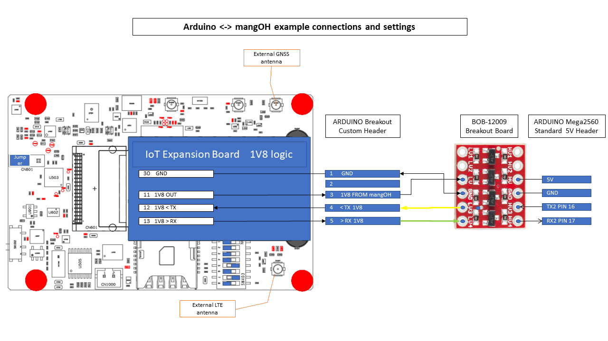

./docs/README.md

# Arduino to mangOH yellow demo

## Hardware
Parts required
1. mangOH yellow with Octave WP7702 minimum FW 2.1.4
1. IoT Expansion board
1. BOB-12009 level shifter
1. Arduino mega2560

Datasheets and schematics are [available here](./HardwareDatasheets)

Connections are documented below - note that the mangOH is low voltage (LV) and the Arduino is high voltage (HV)

Pictures of the completed system

  

## Arduino Software
The purpose of this project is to enable external microcontroller devices to exchange data with Octave using the Octave Resource Protocol via hardware UARTs. 

The sketch [octaveAdcDemoSketch.ino](c/AppExamples/ArduinoAvr/octaveAdcDemoSketch) is a simple demo where the Arduino uploads raw ADC data to Octave and the Arduino receives a number as a string from Octave.

The main loop is implemented as a basic state machine. It has the following steps.

0. Send a command to Octave to register an Octave input - if this is successful 
   the state changes to 1.
1. Send a command to Octave to register an Octave output - if this is successful 
   the state changes to 2.
2. Send a command to Octave to register an Octave output call back - if this is 
   successful the state changes to 3.
3. Periodically send the Arduino ADC data to Octave via the Octave input 

The application has a two callback handlers
1. Request response callback handler - this is called when Octave responses 
to request commands
2. Notification callback handler - this is called when Octave sends data to the application. The payload is in ORP format - the application callback handler contains an example payload decode.

The example does not contain any error handling or robust handling of problems. For example if the mangOH is reset the Arduino application will not be able to successfully send data to Octave because the Octave IO would need to be re-registered.
